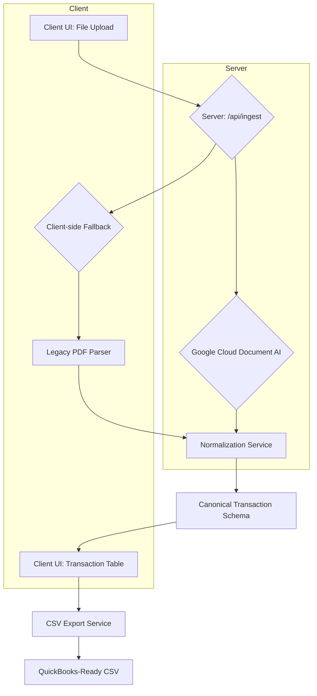

# Application Architecture

This document provides a high-level overview of the bank statement parser application architecture, detailing the data flow from document upload to CSV export.

## High-Level Diagram

## Ingestion Flow Sequence

The application follows a Document AI-first approach with a robust client-side fallback mechanism. This ensures that documents are processed even if Document AI is unavailable or encounters an error.

1.  **File Upload**: The user uploads a PDF bank statement through the client-side user interface.

2.  **Server-Side Processing**: The file is sent to the server's `/api/ingest` endpoint. The server then forwards the document to Google Cloud Document AI for processing.

3.  **Document AI Extraction**: Google Cloud Document AI analyzes the document and extracts entities such as transactions, dates, and amounts.

4.  **Client-Side Fallback**: If the server-side processing fails (e.g., Document AI is disabled, misconfigured, or returns an error), the client initiates a fallback mechanism. It uses a built-in legacy PDF parser (`pdf.js`) to extract text from the document.

## DocAI → Canonical Normalization → UI → Export Pipeline

The core of the application is a pipeline that transforms raw extracted data into a structured, usable format.

1.  **Normalization to Canonical Schema**: Regardless of the source (Document AI or the legacy parser), the extracted data is passed to a normalization service. This service transforms the data into a consistent `CanonicalTransaction` schema. This schema is the single source of truth for transaction data within the application and ensures uniformity.

2.  **Display in UI**: The normalized transactions are sent to the client UI and displayed in a table, allowing the user to review the extracted data.

3.  **CSV Export**: When the user is satisfied with the data, they can export it as a CSV file. The export service takes the array of `CanonicalTransaction` objects and formats them into a QuickBooks-compatible CSV file. The user can also choose to include a UTF-8 BOM for better compatibility with spreadsheet applications.
